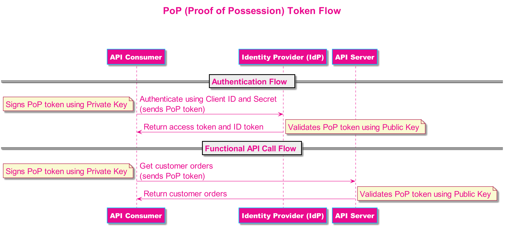

# T-Mobile API Security Libraries

## Overview

"T-Mobile API Security Libraries" provides the libraries which can be leveraged to implement the API security within your enterprise. Currently it provides the PoP (Proof of Possession) token builder and validator related libraries. Proof of possession (PoP) helps enabling the message integrity and also helps avoiding the transaction replay and token theft. For each API request the new PoP token is created by API consumer and signed by the client's private key which can then be verified using the client's public key at API gateway. The PoP token builder libraries are available in multiple languages.

## Directory Structure

```bash
└── tmobile-api-security-lib                                # T-Mobile API Security Lib Parent Directory
    └── poptoken-lib                                        # PoP Token Lib Parent Directory
        ├── poptoken-builder                                # PoP Token Builder Lib Parent Directory
        │   ├── java-lib-tmobile-oss-poptoken-builder       # Java PoP Token Builder Lib
        │   ├── js-lib-tmobile-oss-poptoken-builder         # JavaScript PoP Token Builder Lib
        │   ├── android-lib-tmobile-oss-poptoken-builder    # Android PoP Token Builder Lib
        │   └── ios-lib-tmobile-oss-poptoken-builder        # iOS PoP Token Builder Lib
        │   └── C#-lib-tmobile-oss-poptoken-builder         # C# .NetCore PoP Token Builder Lib
        └── poptoken-validator                              # PoP Token Validator Lib Parent Directory
            └── java-lib-tmobile-oss-poptoken-validator     # Java PoP Token Validator Lib
```

## Available Libraries 

### PoP Token Libraries

The OAuth 2.0 bearer token specification, as defined in RFC6750, allows any party in possession of a bearer token (a "bearer") to get access to the associated resources (without demonstrating possession of a cryptographic key). To prevent misuse, bearer tokens must be protected from disclosure in transit and at rest.

Some scenarios demand additional security protection, whereby a client needs to demonstrate possession of cryptographic keying material when accessing a protected resource.

Proof of possession (PoP) provides a mechanism to bind key material to access tokens. This key material can then be used by the client to add signatures to outgoing HTTP requests to the resource server. The resource server in turn can use the key material to make sure that the sender is the same entity that requested the token in the first place (as opposed to someone who stole the token in transit or at rest).

Proof of possession (PoP) helps enabling the message integrity and also helps avoiding the transaction replay and token theft. For each API request the new PoP token is created by API consumer and signed by client's private key which can then be verified using client's public key at API gateway.

#### PoP Token Flow




#### PoP Token Format

The format of the PoP token used by T-Mobile is:
```bash
Header: {alg, type} 
Body { 
  iat: <epoch time> 
  exp: <epoch time> 
  ehts: <authorization; content_type; uri; http-method; body> => All request headers, URI, HTTP method and body fields used to create hash
  edts: <Base64UrlSafeEncoding[SHA256(all ehts claim values as a concatenated string)]">
  jti: <unique identifier> 
  v: "1"
}
Signature: <digitalSignature>
```

## License

The T-Mobile API security libraries are released under the <a href="https://github.com/tmobile/tmobile-api-security-lib/blob/master/LICENSE" target="_blank">Apache 2.0 License</a>.
